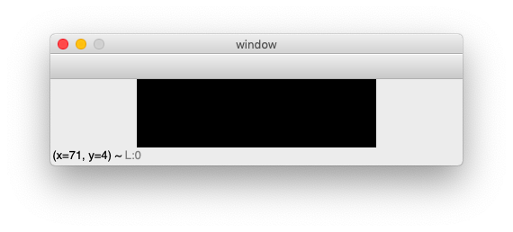

Creating an application
=======================

In this section we are going to create an application from zero. 
Our goal to establish a general framework which can be the basis 
for different kinds of applications, such as editors, browsers or video games.

We start by importing the **OpenCV** and the **numpy** module and give
them the usual abbreviations::

    import cv2 as cv
    import numpy as np

Then we declare the ``App`` class which creates a named window with 
``namedWindow``. Without any window the ``waitKey`` function does not work::

    class App:
        def __init__(self):
            cv.namedWindow('window0')

Now we need a method to run the application::

    def run(self):
        key = ''
        while key != 'q':
            k = cv.waitKey(0)
            key = chr(k)
            print(k, key)

        cv.destroyAllWindows()

We wait for a key from the keyboard. The argument of the ``waitKey`` function means the 
timeout period in miliseconds. A value of 0 means to wait without a time limit.
If we wanted to display the frames of a video stream every 25 miliseconds,
we could write ``cv.waitKey(25)``. If no key is pressed during this period, 
a -1 integer value is returned.

Typing *q* quits the event loop and closes all windows.

At the end of the program we add code to instantiate the App and
to call the ``run()`` method::

    if __name__ == '__main__':
        App().run()

With  ``cv.namedWindow('window0')`` OpenCV opens a smll black image such 
as shown below.



On a Mac the some of the key presses do not give a result and some of the keys have
a code value of 0. These keys have:

* no key code: cmd, fn, Up, Down, Left, Right
* key code 0: alt, ctrl, shift

All letters are lower-case only. We will see later how we can use the code 0 of the
alt/ctrl/shift key to toggle between lower case and upper case letters.

Shortcut keys
-------------

It is convienent for an application to have shortcut keys. The most efficient way to 
define to associate certain keys with a function is to use a dictionary.
In the App class **init** function we add::

    self.shortcuts = {  'h': help, 
                        'i': self.inspect,}

This dictionary associates the letter **h** with the function ``help()`` and the letter 
**i** with the function ``self.inspect()``. Later we will add more shortcut functions.

In the App class we define the ``key`` handler:

    def key(self, k):
        if k in self.shortcuts:
            self.shortcuts[k]()

The function **help** is defined as a global function::

    def help():
        print('--- HELP ---')

The function **inspect** is defined as a method of the App class::

    def inspect(self):
        print('--- INSPECT ---')
        print('App.wins', App.wins)
        print('App.win', App.win)

This kind of inspect function is usefull for debugging.


Create the Window class
-----------------------

Some applications have only one window, but often an appliation can
have any number of windows. To track all the windows of an application and specify the
currently active window, we add these two class variables to the ``App```
class::

    class App:
        wins = []
        win = None

**App.wins** is the list of opended windows. **App.win** is the currently
active window.

The ``Window`` class is defined below::

    class Window:
        """Create a window."""
        def __init__(self, win=None, img=None):

First, the new window is added to the Apps window list.
Then it is made the currently active window::

    App.wins.append(self)
    App.win = self

Then the windows object list ``self.objs`` is set to the empty list.
Currently there is now active object, so currently active object ``self.obj`` it's set to ``None``::

    self.objs = []
    self.obj = None

If no image is given, the constructer creates a 200 x 600 pixel default image 
with all pixels being black::

    if img==None:
        img = np.zeros((200, 600, 3), np.uint8)

If no window name is given, a new string is formed from the window id. 
Afterwards the id is incremented to the next higher value::

    if win == None:
        win = 'window' + str(App.win_id)
    App.win_id += 1

The window name and the image are stored as an instance attribute::

    self.win = win
    self.img = img>

As the window is directly modified by adding graphics objects to it, 
we need to keep a copy of the original image::

    self.img0 = img.copy()

Finally we show the image::

    cv.imshow(win, img)


Handle the mouse
----------------

The mouse is handled separately by each window. 
We set a mouse callback function to the window's ``mouse`` handler function::

    cv.setMouseCallback(win, self.mouse)

Inside the ``Window`` class we define a ``mouse`` function which receives the parameters:

* eventy type (mouse down, up, double-click, move)
* postion (x, y)
* flags (3 mouse bottons, 3 modifier keys)

    def mouse(self, event, x, y, flags, param):
            text = 'mouse event {} at ({}, {}) with flags {}'.format(event, x, y, flags)        
            cv.displayStatusBar(self.win, text, 1000)

We display these parameters for 1 second in the status bar.

Inside the ``mouse`` callback function, we dispatch the events, according to 
the event type. There are 12 different types of mouse events::

    EVENT_LBUTTONDBLCLK 7
    EVENT_LBUTTONDOWN 1
    EVENT_LBUTTONUP 4
    EVENT_MBUTTONDBLCLK 9
    EVENT_MBUTTONDOWN 3
    EVENT_MBUTTONUP 6
    EVENT_MOUSEHWHEEL 11
    EVENT_MOUSEMOVE 0
    EVENT_MOUSEWHEEL 10
    EVENT_RBUTTONDBLCLK 8
    EVENT_RBUTTONDOWN 2
    EVENT_RBUTTONUP 5

There are 3 buttons:

* left (LBUTTON)
* middle (MBUTTON)
* right (RBUTTON)

and there are 3 event types:

* down (DOWN)
* up (UP)
* doubleclick (DBLCLK)

Furthermore there are 6 event flags which can be combined together. For exemple,
pressing the left button and the ctrl key simultaneously would result in 9, 
the sum of 1+8::

    EVENT_FLAG_LBUTTON 1
    EVENT_FLAG_MBUTTON 4
    EVENT_FLAG_RBUTTON 2

    EVENT_FLAG_CTRLKEY 8
    EVENT_FLAG_SHIFTKEY 16
    EVENT_FLAG_ALTKEY 32

When a mouse is clicked in a window, this window becomes the active window
and this must be signalled  to the App::

        if event == cv.EVENT_LBUTTONDOWN:
            App.win = self

Create the Object class
-----------------------

An app can have multiple windows, and each window can have multiple objects. 
Only one object is the active object in any one window. 
We add this code to the constructor of the Window class::

    self.objs = []
    self.obj = None

Initially the object list is empty, and there is no active object yet.

Now we can create the Object class::

    class Object:
        """Add an object to the current window."""
        def __init__(self, **options):
            App.win.objs.append(self)
            App.win.obj = self
            self.img = App.win.img

We append the new object to the object list of the currently active window. 
We go through two levels: the app knows the currently active window, 
and the currently active window keeps track of its objects. 

The expression ``App.win.obj`` means the currently active object of 
the currently active window. There is always an active window, which is also the
top window. The window which had been clicked last, becomes the active window.

Finally we set the windows image as the target for the object.

To specify the default options for a new object we use a dictionary: 

* default position (pos)
* default size (size)
* inital id  

This default dictionary defined as a Window **class attribute**, 
and is the same for all windows::

    obj_options = dict(pos=(20, 20), size=(100, 30), id=0)

The current object obtions are defined as Window **instance attribute** 
and is independent for each window. We must be careful to copy the dictionary, 
and not just make a reference to it::

    self.obj_options = Window.obj_options.copy()

Inside the Object constructor we update the object options with the new
options received as argument::

    d = App.win.obj_options
    d.update(options)

Then we assign the id, position and size of the object::

    self.id = d['id']
    self.pos = x, y = d['pos']
    self.size = w, h = d['size']

Then we increment the object id::

    d['id'] += 1

Often objects (buttons, text) are placed in a vertical layout, with a small gap, 
we calculate a new position for the next object automatically::

    d['pos'] = x, y + h + 5

In order name the object, we give define the **str** method::

    def __str__(self):
        return 'Object {} at ({}, {})'.format(self.nbr, *self.pos)

Drawing an object
-----------------

Each object knows how to draw itself. At this point we need to define
some colors at the beginning of the program. Remember that OpenCV uses
the BGR color format::

    BLACK = (0, 0, 0)
    RED = (0, 0, 255)
    GREEN = (0, 255, 0)
    BLUE = (255, 0, 0)
    WHITE = (255, 255, 255)

In the **Object** class we add a **draw** method which draws the object 
by placing a thin rectangle on the image to mark the region occupied by the object::

    def draw(self):
        cv.rectangle(self.img, (*self.pos, *self.size), RED, 1)

In the **Window** class add a **draw** method which draws all the objects. 
First we restore the image from the stored original image. Then we draw all
the objects and finally we show the updated image::

    def draw(self):
        self.img[:] = self.img0[:]
        
        for obj in self.objs:
            obj.draw()

        cv.imshow(self.win, self.img)

At this point, we can redraw the window, whenever there is a mouse event.
So we add this as the last line in the ``mouse`` handler::

        self.draw()


Adding new windows and new objects
----------------------------------

The constructors of the Window and the Object class both have default parameters. 
This allows us to add shortcuts to automatically create new windows and new objects::

    self.shortcuts = {  'h': help, 
                        'i': self.inspect,
                        'w': Window,
                        'o': Object,}


Passing the mouse click to an object
------------------------------------

When a mouse click happens inside an object, this should be handled by that object.
Therefore we need to know if the mouseclick happend inside the object::

    def is_inside(self, x, y):
        x0, y0 = self.pos
        w, h = self.pos
        return x0 <= x <= x0+w and y0 <= y <= y0+h

Inside the Window **mouse** method we add this code::

    if event == cv.EVENT_LBUTTONDOWN:
        App.win = self

        self.obj = None
        for obj in self.objs:
            obj.selected = False
            if obj.is_inside(x, y):
                obj.selected = True
                self.obj = obj

Select an object
----------------

In order to act on an object we need to select it. This can be done by clicking
with the mouse on the object. At the creation of a new object it is not selected::

    self.selected = False

We draw the selected object with a colored contour. This is the modiefied ``draw`` method::

    def draw(self):
        x, y = self.pos
        w, h = self.size
        cv.rectangle(self.img, (x, y, w, h), WHITE, 1)
        if self.selected:
            cv.rectangle(self.img, (x-2, y-2, w+2, h+2), RED, 2)


Moving an object
----------------

If the mouse is clicked over an object, the name of the object is printed::

    def mouse(self, event, x, y, flags, param):
        if event == cv.EVENT_LBUTTONDOWN:
            print(self)

The moving of an object has to be defined in the Window mouse handler and not in the 
Object mouse handler. Depending on the direction we move the object, 
the mouse coordinates can be outside the object.

If the mouse moves and the ALT key is pressed, the current object is moved to the 
cursor position (x, y)::

    if event == cv.EVENT_MOUSEMOVE:
        if flags == cv.EVENT_FLAG_ALTKEY:
            self.obj.pos = x, y


Add window custom options
-------------------------

To make our application as customizable as possible,
we should give all parameters such as the window background color,
the default object color, the selection color as options to the app class.

In the App class we add this line::

    options = dict( win_color=GRAY, obj_color=YELLOW, sel_color=BLUE)

In the Window **init** method we add this::

    if img == None:
        img = np.zeros((200, 600, 3), np.uint8)
        img[:,:] = App.options['win_color']

We update the Object **draw** method to this::

    cv.rectangle(self.img, (x, y, w, h), App.options['obj_color'], 1)
    if self.selected:
        cv.rectangle(self.img, (x-2, y-2, w+2, h+2), App.options['sel_color'], 2)


Displaying information in the status bar
----------------------------------------

The status bar is a convenient place to display feedback information during
program development. 

Compared to printing to the console the statusbar has a double advantage: 

* the info appears in the associated window
* the info disappears after a timeout

This code is added to the ``key`` handler in the Window class::

    text = 'key {} ({})'.format(k, ord(k))
    cv.displayStatusBar(self.win, text, 1000)

This code is added to the ``mouse`` handler in the Window class::

   def mouse(self, event, x, y, flags, param):
        text = 'mouse event {} at ({}, {}) with flags {}'.format(event, x, y, flags)        
        cv.displayStatusBar(self.win, text, 1000)


Create the Text class
---------------------

In order to add text to an object, we subclass the Object class and
we add the text options as a class attribute::

    class Text(Object):
        """Add a text object to the current window."""
        options = dict( fontFace=cv.FONT_HERSHEY_SIMPLEX,
                        fontScale=1,
                        color=BLUE,
                        thickness=1,
                        lineType=cv.LINE_8, )

In the constructor method we update the options, copy them to the Text object,
then we call the parent (Object class) constructor::

    def __init__(self, text='Text', **options):

        for k, v in options.items():
            if k in Text.options:
                Text.options[k] = v


Send key events to windows and objects
--------------------------------------

In order to send key events to a specfic object, we must first send the key event 
from the app level to the currently active window by modifying
the App event loop like this::

    def run(self):
        while True:
            key = cv.waitKey(0)

            if key >= 0:
                k = chr(key)
                if not App.win.key(k):
                    self.key(k)

We first the key event to the Window level by calling ``App.win.key`` handler. 
If the upper level handles the event, it is returning True. In that case 
the App level has does not need to call its own ``key`` handler.

On the app level the letters **w, o, t, i, h** have associated shortcuts. However,
when an object is active for editing, the key press has to go to the active object,
and should not be treated as a shortcut. 

In the Window class we add a ``key`` event handler which 
treats certain keys as special:

* the TAB key to advance to the next object
* the ESCAPE key to unselect the current object
* the CMD/SHFT key to toggle upper and lower case

Again we use a dictionary to associate the keys with their respective actions::

    self.shortcuts = {  '\t': self.select_next_obj,
                        chr(27): self.unselect_obj,
                        chr(0): self.toggle_case, }

At the window level we first see if the key is part of the shortcut keys. If this
is the case, the associated function is called, the image redrawn, and the ``key``
handler returns True, to signal to the caller that the event has been dealed with::

    def key(self, k):
        if k in self.shortcuts:
            self.shortcuts[k]()
            self.draw()
            return True

        elif self.obj != None:
            self.obj.key(k)
            self.draw()
            return True
        
        return False

If the key is not a shortcut key and if there exists an active object, 
the key is sent the **key(k)** handler at the Object level. 
There the key events are used for editing the text attribute.


Use the tab key to advance to the next object
---------------------------------------------

It is convenient to use the tab key to move between objects. 
The following function tries to ``find`` the index of the currently 
selected object, if there is one, and increments it by one::

    def select_next_obj(self):
        """Select the next object, or the first in none is selected."""
        try:
            i = self.objs.index(self.obj)
        except ValueError:
            i = -1
        self.objs[i].selected = False
        i = (i+1) % len(self.objs)
        self.objs[i].selected = True
        self.obj = self.objs[i]


Use the escape key to unselect
------------------------------

The escape key can serve to unselect an object. We add the following code to 
the Window class::

    def unselect_obj(self):
        if self.obj != None:
            self.obj.selected = False
            self.obj = None


Toggle between upper case and lower case
----------------------------------------

The OpenCV module does not allow to get upper-case letters.
To be able to input upper case letters we use the keys which result 
in a key code of 0 to switch between upper case and lower case.
To implement this we add the following code to the Window ``key`` handler::

        elif k == chr(0):  # alt, ctrl, shift
            self.upper = not self.upper
            if self.upper:
                cv.displayStatusBar(self.win, 'UPPER case', 1000)
            else:
                cv.displayStatusBar(self.win, 'LOWER case', 1000)
            return True


Update size of the text object
------------------------------

When text is edited, the size of the object changes. We use this 
function to get the new size::

    def get_size(self):
        """Returns the text size and baseline under the forme (w, h), b."""
        d = self.text_options
        return cv.getTextSize(self.text, d['fontFace'], d['fontScale'],d['thickness'])


Creating the Node class
-----------------------

To place geometric elements into the window we are creating a **Node** class 
which has the following attributes:

* position (top left corner)
* size
* direction of the next object
* gap between adjacent objects

We store the default options as Node **class attribute**::

    class Node:
        options = dict( pos=np.array((20, 20)),
                        size=np.array((100, 40)), 
                        gap=np.array((10, 10)),
                        dir=np.array((0, 1)),
                        )

In the Node constructor, we can change these 4 options by specifing 
a named parameter. If the parameter is given in the form of a tuple, 
such as ``size=(50, 20)`` the tuple needs to be transformed into an 
**np.array**. Only the 4 elements of the options dictionary are updated::

    def __init__(self, parent, **options):

        # update node options from constructor options
        for k, v in options.items():
            if k in Node.options:
                if isinstance(v, tuple):
                    v = np.array(v)
                Node.options[k] = v

Then we create empty instance attributes::

       # create instance attributes
        self.pos = None
        self.size = None
        self.gap = None
        self.dir = None

We give them values from the node optionss::

        # update instance attributes from node options
        self.__dict__.update(Node.options)

Finally we calculate the next node position::

        pos = self.pos + (self.size+self.gap)*self.dir
        Node.options['pos'] = pos

Drawing the node
^^^^^^^^^^^^^^^^

Nodes need to be drawn recursively. If a node has chidren, 
these need to be drawn as well. The ``draw`` method needs a position
argument to draw the children with respect to the parent position.
The default position is (0, 0). If the node is selected, a selection
rectangle is drawn around it::

    def draw(self, pos=np.array((0, 0))):
        x, y = pos + self.pos
        w, h =  self.size
        cv.rectangle(self.img, (x, y, w, h), RED, 1)
        if self.selected:
            cv.rectangle(self.img, (x-2, y-2, w+4, h+4), GREEN, 1)

        for child in self.children:
            child.draw(self.pos)

Checking if a position is inside
^^^^^^^^^^^^^^^^^^^^^^^^^^^^^^^^

Using the **numpy** library makes 2D calculation easy. We can compare 
the components of a vector at once, such as ``self.pos < pos``, which
results in a boolean vector of the form ``[True False]``. The function
``all()`` returns True if all vector components are True::

    def is_inside(self, pos):
        """Check if the point (x, y) is inside the object."""
        pos = np.array(pos)
        return all(self.pos < pos) and all(pos < self.pos+self.size)

Finde the enclosure for children
^^^^^^^^^^^^^^^^^^^^^^^^^^^^^^^^

If several nodes are placed inside another node, at the end the size of
the parent nodes needs to be adapted to enclose all children. Here
the ``np.maximum`` function finds the maximum coordinates of two vectors::

    def enclose_children(self):
        p = np.array((0, 0))
        for node in self.children:
            p = np.maximum(p, node.pos+node.size)
        self.size = p
