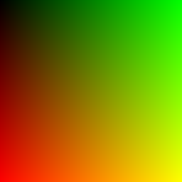
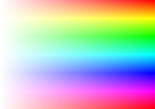
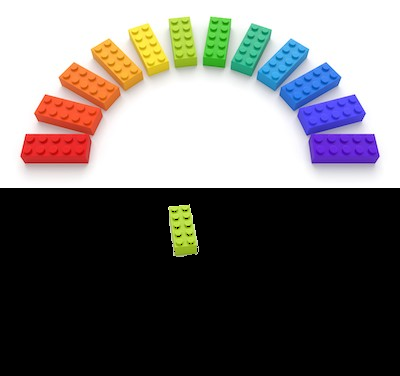

Color spaces
============

In the following image BGR = (z, h, v) blue is zero
green increases in the horizontal direction, 
red increases in the horizhontal direction.
We have black, red, green and yellow in the 4 corners.

.. literalinclude:: rgb2.py

:download:`rgb2.py<rgb2.py>`

Sliding through the color cube
------------------------------

The RGB colors space is a cube of dimension $256 x 256 x 256$.
In the following program we display **Blue** and **Green** and use 
the trackbar to select the **Red** component.

.. image:: rgb3.png

.. literalinclude:: rgb3.py

:download:`rgb3.py<rgb3.py>`

The HSV colorspace
------------------

The HSV color space is a cube of dimension 180x256x256.

.. literalinclude:: hsv2.py

:download:`hsv2.py<hsv2.py>`

Extracting an object based on hue
---------------------------------

.. literalinclude:: hsv3.py

:download:`hsv3.py<hsv3.py>`

