Drawing shapes
==============

OpenCV has different drawing functions to draw:

* lines
* circle
* rectangle
* ellipse
* text

Using Numpy
-----------

Numpy is a very powerful math module for dealing with multi-dimensional data such as 
vectors and images. The OpenCV images are represented as Numpy arrays.
At the start of a program we import both::

    import cv2 as cv
    import numpy as np

To create an empty color image we create a 3D array of zeroes::

    img = img = np.zeros((100, 600, 3), np.uint8)
    cv.imshow('RGB', img)

When zooming, we can see the 3 color components.

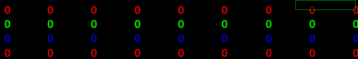

To create an empty gray-scale image we create a 2D array of zeroes::

    gray_img = np.zeros((100, 600), np.uint8)
    cv.imshow('Gray', gray_img)

The grayscale values for each pixel go from 0 to 255. 
In a black image all pixel values are 0.

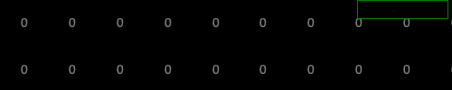

.. literalinclude:: draw1.py

:download:`draw1.py<draw1.py>`

Define colors
-------------

Colors are defined by three base colors: Blue, Green and Red.
All three put to zero gives black, all three at the maximum gives white::

    BLACK = (0, 0, 0)
    WHITE = (255, 255, 255)

Different from the more common RGB ordering, OpenCV uses the ordering BGR::

    RED = (0, 0, 255)
    GREEN = (0, 255, 0)
    BLUE = (255, 0, 0)

Mixing color components results in more colors::

    CYAN = (255, 255, 0)
    MAGENTA = (255, 0, 255)
    YELLOW = (0, 255, 255)

Draw a line
-----------

The function ``cv.line()`` adds a line to an image::
    
    cv.line(image, p0, p1, color, thickness)

* **image** where the line is added
* start point **p0**
* end point **p1**
* line **color**
* line **thickness**

Lets define three points::

    p0 = 10, 10
    p1 = 300, 90
    p2 = 500, 10

Now we can draw two colored lines::

    cv.line(img, p0, p1, RED, 2)
    cv.line(img, p1, p2, YELLOW, 5)

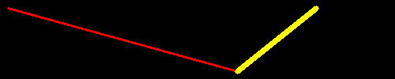

If the image is a gray-scale image, instead of the color triplet, a grayscale 
value from 0 (black) to 255 (white) is used::

    cv.line(gray_img, p0, p1, 100, 2)
    cv.line(gray_img, p1, p2, 255,5)

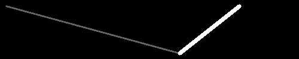

.. literalinclude:: line1.py

:download:`line1.py<line1.py>`

Select thickness with a trackbar
--------------------------------

We can use a trackbar to set the thickness of the line.
The trackbar callback function has one argument - the line thickness.
Trackbar arguments are always integer and they always start at 0.
However, for lines the smallest line thickness is 1. 
Therefore we use the ``max`` function to make the thickness at least 1.
To have a numeric feedback, we display the thickness value also in the overlay::

    def trackbar(x):
        x = max(1, x)
        cv.displayOverlay('window', f'thickness={x}')

Next we have to redraw the line. We start by resetting the image to 0. 
Then we draw the line and display the new image::

    img[:] = 0 
    cv.line(img, p0, p1, RED, x)
    cv.imshow('window', img)

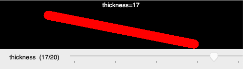

.. literalinclude:: line2.py

:download:`line2.py<line2.py>`

Select color with a trackbar
----------------------------

We can use a trackbar to set the line color.
The trackbar is used to select an index into a color list which we define with 7 colors::

    colors = (RED, GREEN, BLUE, CYAN, MAGENTA, YELLOW, WHITE)

The trackbar is defined to return an integer value from 0 to 6::

    cv.createTrackbar('color', 'window', 0, 6, trackbar)

Inside the trackbar callback function we use the index to look up the color.
To give numeric feedback we display the color RGB value in the overlay::

    def trackbar(x):
        color = colors[x]
        cv.displayOverlay('window', f'color={color}')

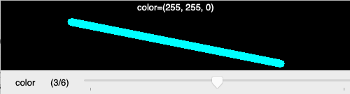

.. literalinclude:: line3.py

:download:`line3.py<line3.py>`

Select end point with the mouse
-------------------------------

Let's use the mouse for selecting the end point of the line.
The mouse callback function has the x and y coordinates as arguments.
We are only interesed in the mouse movement when a button is pressed (flags==1).
The current mouse coordinates will be the new end point for the line.
We display this coordinates in the overlay::

    def mouse(event, x, y, flags, param):
        if flags == 1:
            p1 = x, y
            cv.displayOverlay('window', f'p1=({x}, {y})')

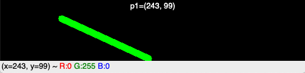

.. literalinclude:: line4.py

:download:`line4.py<line4.py>`

Draw a complete line
--------------------

Let's now draw a complete line with the mouse.
Now we need to distinguish between mouse down, mouse move and mouse up events.
When the mouse is down, we start a new line and set both points ``p0`` and ``p1``
to the current mouse position::

   if event == cv.EVENT_LBUTTONDOWN:
        p0 = x, y
        p1 = x, y

If the mouse moves (with the button pressed) or if the mouse button goes up,
we only set ``p1`` to the new mouse position::

    elif event == cv.EVENT_MOUSEMOVE and flags == 1:
        p1 = x, y

    elif event == cv.EVENT_LBUTTONUP:
        p1 = x, y

At the end of the mouse callback function we reset the image to zero (black),
draw the line, display the new image and show the two points in the overlay::

    img[:] = 0
    cv.line(img, p0, p1, RED, 10)
    cv.imshow('window', img)
    cv.displayOverlay('window', f'p0={p0}, p1={p1}')

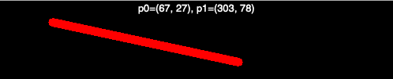

.. literalinclude:: line5.py

:download:`line5.py<line5.py>`

Draw multiple lines
-------------------

How do we do to draw multiple lines to an image?
First we need to have a temporary copy ``img0`` which contains the lines  
of the previous stage of the drawing::

    img0 = np.zeros((100, 500, 3), np.uint8)
    img = img0.copy()

When the mouse button is down, we set the two points ``p0`` and ``p1``
to the current mouse position::

    if event == cv.EVENT_LBUTTONDOWN:
        p0 = x, y
        p1 = x, y

When the mouse moves, we reset the current image to the previous image ``img0`` 
and draw a blue line of thickness 2::

    elif event == cv.EVENT_MOUSEMOVE and flags == 1:
        p1 = x, y
        img[:] = img0
        cv.line(img, p0, p1, BLUE, 2)

When the mouse goes up, we reset the image to the previous image ``img0``, 
draw a red line of thickness 4, and save this new image as ``img0``::

    elif event == cv.EVENT_LBUTTONUP:
        img[:] = img0
        cv.line(img, p0, p1, RED, 4)
        img0[:] = img        

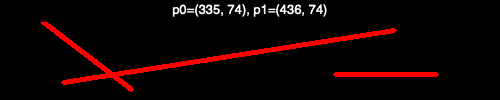

.. literalinclude:: line6.py

:download:`line6.py<line6.py>`

Draw a rectangle
----------------

The function ``cv.rectangle()`` adds a rectangle to an image::
    
    cv.rectangle(image, p0, p1, color, thickness)

* **image** where the rectangle is added
* corner point **p0**
* corner point **p1**
* ouline **color**
* line **thickness**

If the line thickness is negative or ``cv.FILLED`` the rectangle is filled::

    cv.rectangle(img, p0, p1, BLUE, 2)
    cv.rectangle(img, p2, p3, GREEN, cv.FILLED)

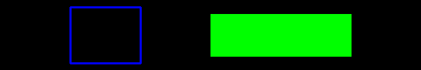

.. literalinclude:: rect1.py

:download:`rect1.py<rect1.py>`

Draw multiple rectangles
------------------------

Now we combine thickness and color trackbar as welle as the mouse callback to 
create multple rectangles.

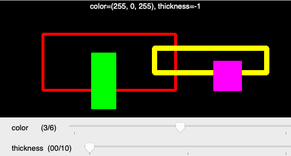

.. literalinclude:: rect2.py

:download:`rect2.py<rect2.py>`

The common code such as color definitions and image creation has been placed
in a separate file.

.. literalinclude:: draw.py

:download:`draw.py<draw.py>`

Draw an ellipse
---------------

The function ``cv.ellipes()`` adds an ellipse to an image::

    cv.ellipse(img, center, axes, angle, a0, a1, color, thickness)

* **image** where the ellipse is added
* **center** point
* the two **axes**
* the axis orientation **angle**
* the beginning angle **a0**
* the ending angle **a1**
* ouline **color**
* line **thickness**

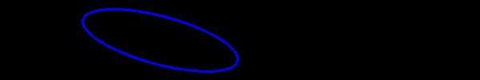

.. literalinclude:: draw4.py

:download:`draw4.py<draw4.py>`

Draw a polygon
--------------

The ``polylines`` function expects a Numpy array for the point list::

    pts = [(50, 50), (300, 190), (400, 10)]
    cv.polylines(img, np.array([pts]), True, RED, 5)

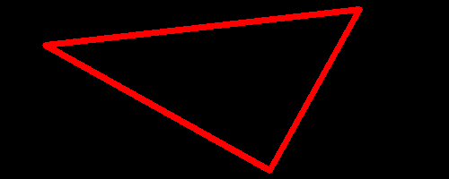

.. literalinclude:: polygon1.py

:download:`polygon1.py<polygon1.py>`

Draw a filled polygon
--------------

The ``polylines`` function expects a Numpy array for the point list::

    pts = [(50, 50), (300, 190), (400, 10)]
    cv.polylines(img, np.array([pts]), True, RED, 5)

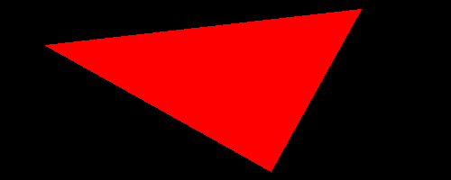

.. literalinclude:: polygon2.py

:download:`polygon2.py<polygon2.py>`

Draw a polygon with the mouse
-----------------------------

Combining the previous techniques, it is rather simple to draw a polygon 
just by clicking into the window. First we define an empty list::

    pts = []

Each time we click with the mouse we append a point::

    def mouse(event, x, y, flags, param):
        if event == cv.EVENT_LBUTTONDOWN:
            pts.append((x, y))
            draw(0)

.. image:: polygon3.png

.. literalinclude:: polygon3.py

:download:`polygon3.py<polygon3.py>`

Draw text
---------

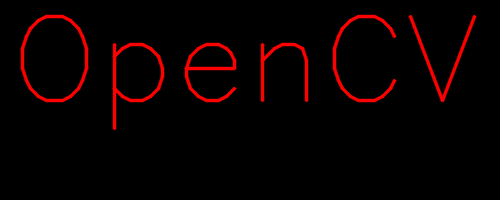

.. literalinclude:: text1.py

:download:`text1.py<text1.py>`

Reference:
https://docs.opencv.org/4.2.0/d6/d6e/group__imgproc__draw.html