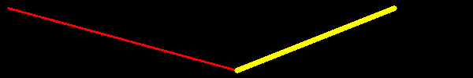
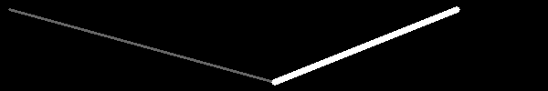

Drawing shapes
==============

OpenCV has different drawing functions to draw:

* lines
* circle
* rectangle
* ellipse
* text

Using Numpy
-----------

Numpy is a very powerful math module for dealing with multi-dimensional data such as 
vectors and images. The OpenCV images are represented as Numpy arrays.
At the start of a program we import both::

    import cv2 as cv
    import numpy as np

To create an empty color image we create a 3D array of zeroes::

    img = img = np.zeros((100, 600, 3), np.uint8)
    cv.imshow('RGB', img)

When zooming, we can see the 3 color components.

.. image:: draw1_rgb.png

To create an empty gray-scale image we create a 2D array of zeroes::

    gray_img = np.zeros((100, 600), np.uint8)
    cv.imshow('Gray', gray_img)

The grayscale values for each pixel go from 0 to 255. 
In a black image all pixel values are 0.

.. image:: draw1_gray.png

.. literalinclude:: draw1.py

:download:`draw1.py<draw1.py>`

Define colors
-------------

Colors are defined by three base colors: Blue, Green and Red.
All three put to zero gives black, all three at the maximum gives white::

    BLACK = (0, 0, 0)
    WHITE = (255, 255, 255)

Different from the more common RGB ordering, OpenCV uses the ordering BGR::

    RED = (0, 0, 255)
    GREEN = (0, 255, 0)
    BLUE = (255, 0, 0)

Mixing color components results in more colors::

    CYAN = (255, 255, 0)
    MAGENTA = (255, 0, 255)
    YELLOW = (0, 255, 255)

Draw a line
-----------

The function ``cv.line()`` adds a line to an image::
    
    cv.line(image, p0, p1, color, thickness)

* **image** where the line is added
* start point **p0**
* end point **p1**
* line **color**
* line **thickness**

Lets define three points::

    p0 = 10, 10
    p1 = 300, 90
    p2 = 500, 10

Now we can draw two colored lines::

    cv.line(img, p0, p1, RED, 2)
    cv.line(img, p1, p2, YELLOW, 5)

If the image is a gray-scale image, instead of the color triplet, a grayscale 
value from 0 (black) to 255 (white) is used::

    cv.line(gray_img, p0, p1, 100, 2)
    cv.line(gray_img, p1, p2, 255,5)

.. literalinclude:: draw2.py

:download:`draw2.py<draw2.py>`

Draw a rectangle
----------------

The function ``cv.rectangle()`` adds a rectangle to an image::
    
    cv.rectangle(image, p0, p1, color, thickness)

* **image** where the rectangle is added
* corner point **p0**
* corner point **p1**
* ouline **color**
* line **thickness**

If the line thickness is negative or ``cv.FILLED`` the rectangle is filled::

    cv.rectangle(img, p0, p1, BLUE, 2)
    cv.rectangle(img, p2, p3, GREEN, cv.FILLED)

.. image:: draw3.png

.. literalinclude:: draw3.py

:download:`draw3.py<draw3.py>`

Draw an ellipse
---------------

The function ``cv.ellipes()`` adds an ellipse to an image::

    cv.ellipse(img, center, axes, angle, a0, a1, color, thickness)

* **image** where the ellipse is added
* **center** point
* the two **axes**
* the axis orientation **angle**
* the beginning angle **a0**
* the ending angle **a1**
* ouline **color**
* line **thickness**

.. image:: draw4.png

.. literalinclude:: draw4.py

:download:`draw4.py<draw4.py>`

Reference:
https://docs.opencv.org/4.2.0/d6/d6e/group__imgproc__draw.html