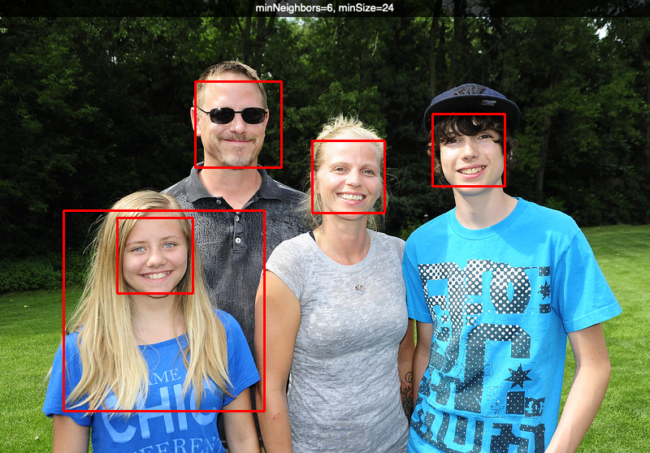
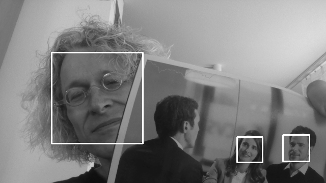

Detect faces
============

.. image:: face1.png

.. literalinclude:: face1.py

Use trackbars to select parameters
----------------------------------

The cascade detector allows to detect faces in an image.

.. literalinclude:: face2.py

Video face detection
--------------------

Now let's use the video camera to do face detection.

.. literalinclude:: face3.py

