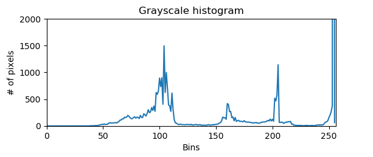
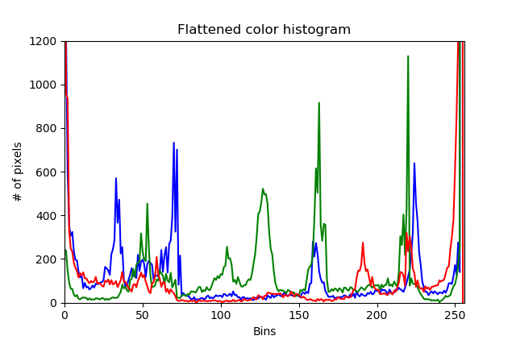
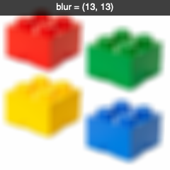

Histograms
==========

A histogram is a graphical representation of the intensity distribution of pixels in an image. It provides valuable insight into the image's tonal range, color balance, and contrast.

Grayscale histogram
-------------------

For grayscale images, each pixel intensity value ranges from 0 (black) to 255 (white). The histogram shows the number of pixels for each intensity value.

The ``calcHist`` function takes these arguments::

    cv.calcHist([img], channels, mask, bins, ranges)

* image list
* channel list
* mask
* the number of **bins**
* ranges, typically [0, 255]

.. literalinclude:: histogram1.py

:download:`histogram1.py<histogram1.py>`

Color histogram
---------------
.. image:: lego.png

Here is the histogram

.. literalinclude:: histogram2.py

:download:`histogram2.py<histogram2.py>`

Blurring
--------

.. literalinclude:: blur1.py

:download:`blur1.py<blur1.py>`
