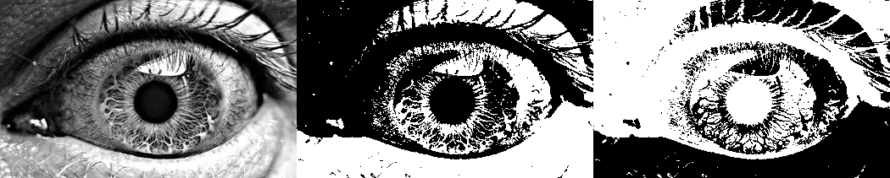
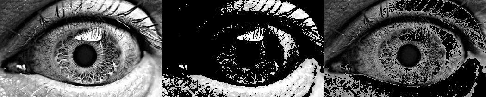
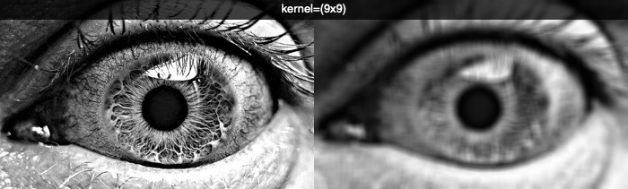
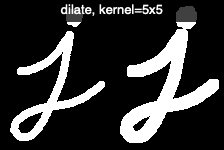
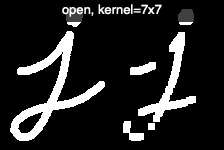
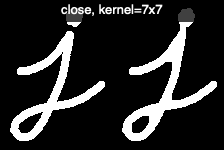
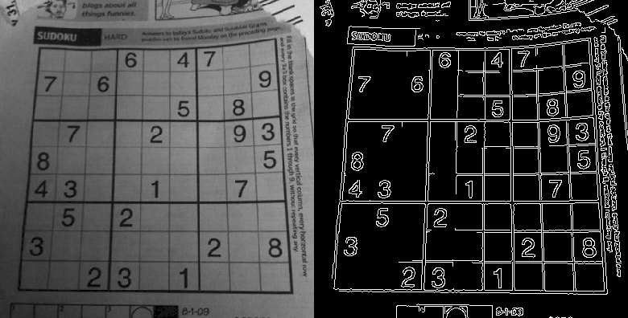

Filters and convolution
=======================

https://docs.opencv.org/master/d2/d96/tutorial_py_table_of_contents_imgproc.html

Simple thresholding
-------------------

For every pixel, the same threshold is applaied. 
If the pixel is smaller then the threshold, it is set to 0, otherwise it is set to the maximum.

.. literalinclude:: threshold0.py

:download:`threshold0.py<threshold0.py>`

Binary thresholding
-------------------

.. literalinclude:: threshold1.py

:download:`threshold1.py<threshold1.py>`

To zero
-------

.. literalinclude:: threshold2.py

:download:`threshold2.py<threshold2.py>`

Adaptive thresholding
---------------------

https://docs.opencv.org/master/d7/d1b/group__imgproc__misc.html#ga72b913f352e4a1b1b397736707afcde3

2D convolution
--------------

https://docs.opencv.org/master/d4/d13/tutorial_py_filtering.html

.. literalinclude:: convolution1.py

:download:`convolution1.py<convolution1.py>`

Morphological Transformations
-----------------------------

Erosion
^^^^^^^

.. literalinclude:: morph1.py

:download:`morph1.py<morph1.py>`

Dilation
^^^^^^^^

.. literalinclude:: morph2.py

:download:`morph2.py<morph2.py>`

Opening
^^^^^^^

.. literalinclude:: morph3.py

:download:`morph3.py<morph3.py>`

Closing
^^^^^^^

.. literalinclude:: morph4.py

:download:`morph4.py<morph4.py>`

Image gradient - Laplacian
--------------------------

.. literalinclude:: gradient.py

:download:`gradient.py<gradient.py>`

Canny edge detection
--------------------

.. literalinclude:: canny.py

:download:`canny.py<canny.py>`