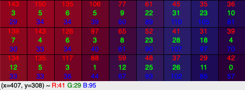
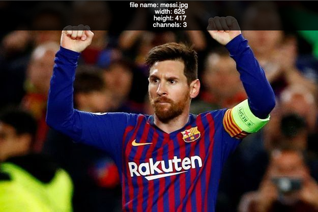
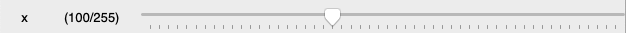
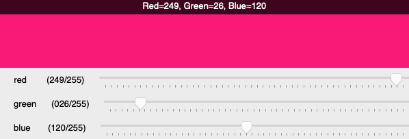
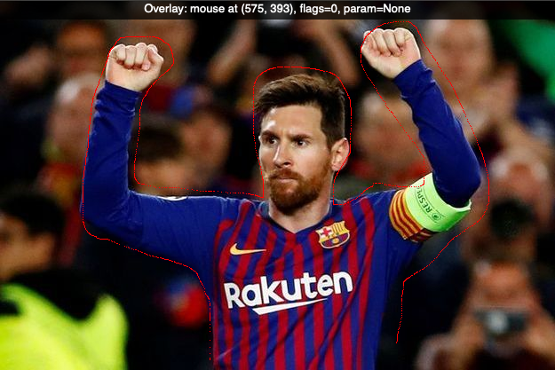
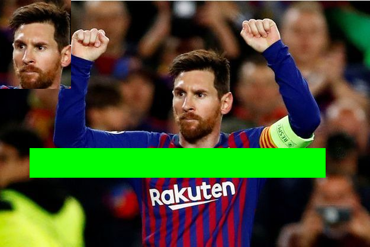

Introduction
============

In this section we look at the basic operations for displaying images in a window
and reacting to mouse and keyboard events.

Load and show an image
----------------------

OpenCV is a library for image processing. We start this tutorial 
by opening a file and displaying it in a window.

First we import the OpenCV library ``cv2`` and give it the shortcut ``cv``. ::

    import cv2 as cv

Then we load an image from the current folder with the function ``cv.imread``
and display it with the function ``cv.imshow`` in a window called **window**.  ::

    img = cv.imread('messi.jpg')
    cv.imshow('window', img)

You can download the image here: 

:download:`messi.jpg<messi.jpg>`

Without calling the ``cv.waitKey()`` no window is displayed. The parameter of this function is the number of 
miliseconds the function waits for a keypress. With a value of 0 the function waits indefinitely.
Once a key is pressed, the program advances to the last line and destroys all windows. ::

    cv.waitKey(0)
    cv.destroyAllWindows()

Clicking the *window close* button closes the window, but does not quit the program. 
After closing the window, a key press has no effect anymore and the only way to quit the program is by 
choosing **Quit** from the (Python) menu, or by pressing the shortcut **cmd+Q**.

.. literalinclude:: intro1.py
   :caption: Here is the complete code.

:download:`intro1.py<intro1.py>`

What's a pixel?
---------------

Images are made of pixels. They are the colored dots that compose an image. 
If you zoom into an image you can see squares of uniform color.
Use the mouse wheel and try to zoom into an OpenCV image.

It shows also the RGB color values at the mouse position (currently at R=41, G=29, B=95).
To the left are reddish pixels, to the right are blueish pixels.

The status line shows the mouse position (currently at x=470, y=308). 
Move the mouse to explore the coordinate system. 
The origine (0, 0) is at the top left position. 

* The x coordinate increases from left to right
* The y coordinate increases from top to bottom

The highest values are at the bottom right corner, 
which gives you the size of the image.

Save an image
-------------

Saving an image is very simple. Just use ``imwrite(file, img)`` 
and supply the file name with a recognized image format extension (.jpg, .png, .tiff).
OpenCV automatically converts to the desired format.

To change the image to a grayscale image use this function:: 

    gray = cv.cvtColor(img, cv.COLOR_BGR2GRAY)

.. literalinclude:: intro1_save.py

:download:`intro1_save.py<intro1_save.py>`

Capture live video
------------------

To capture video we must create a ``VideoCapture`` object. 
The index 0 refers to the default camera (built-in webcam)::

    cap = cv.VideoCapture(0)

Inside a loop we read the video capture to get frames.
We then operate on the frame (convert to grayscale), then display the result,
and then loop back. The loop finishes when **q** is pressed::

    while True:
        # Capture frame-by-frame
        ret, frame = cap.read()

        # Our operations on the frame come here
        gray = cv.cvtColor(frame, cv.COLOR_BGR2GRAY)

        # Display the resulting frame
        cv.imshow('window', frame)
        if cv.waitKey(1) & 0xFF == ord('q'):
            break

At the end the video stream is relased and all windows are closed::

    # When everything done, release the capture
    cap.release()
    cv.destroyAllWindows()

.. literalinclude:: intro2.py
   :caption: Here is the complete code.

:download:`intro2.py<intro2.py>`

Add an overlay
--------------

An overlay can be added to a window to add a line of text during a certain time delay.
This is the fonction::

    cv.displayOverlay(window, text, delay=0)

The overlay text is white on black background, centered and can be displayed 
on multiple lines::

    cv.displayOverlay('image', 'line 1\nline 2\nline 3')

.. literalinclude:: overlay.py

:download:`overlay.py<overlay.py>`

The following program adds the following information:

* the file name
* the width of the image (in pixels)
* the height of the image
* the number of channels (3 for RGB)

OpenCV images are Numpy arrays::

>>>type(img)
<class 'numpy.ndarray'>

Such an array has the attribute ``shape`` which returns the array dimensions.

.. literalinclude:: overlay2.py

:download:`overlay2.py<overlay2.py>`

Add a trackbar
--------------

A trackbar is a slider added at the bottom of the window.

The function takes the following arguments::

    cv.createTrackbar(name, window, value, maxvalue, callback)

* the trackbar **name**
* the **window** where to add the trackbar
* the initial **value**
* the maximum value **maxvalue** on a scale starting at 0
* the **callback** function called if the slider is moved

The ``createTrackbar`` command adds a trackbar below the main image. 
It goes from 0 to 255 and we set the initial value to 100. 
When the trackbar is moved, it calls a callback function named ``trackbar``::

    cv.createTrackbar('x', 'image', 100, 255, trackbar)

The callback function ``trackbar`` displays the trackbar position in the overlay 
region on getTrackbarPosof the window::

    def trackbar(x):
        """Trackbar callback function."""
        text = f'Trackbar: {x}'
        cv.displayOverlay('image', text, 1000)
        cv.imshow('image', img)

The function ``cv.imshow`` is used to force an update of the window.

.. literalinclude:: trackbar.py

:download:`trackbar.py<trackbar.py>`

Compose an RGB color
--------------------

We can use three trackbars for composing a color.
First we use the Numpy ``zero()`` function to create a black image 
with a dimension of (100, 600). ::

    img = np.zeros((100, 600, 3), 'uint8')

Inside the trackbar callback function ``rgb`` we get the 3 trackbar positions
with the red, green and blue color components which can vary from 0 to 255. ::

    r = cv.getTrackbarPos('red','window')
    g = cv.getTrackbarPos('green','window')
    b = cv.getTrackbarPos('blue','window')

Then we reset the image array with the new color value. 
OpenCV uses the BGR order. Be careful to use the right order. ::

    img[:] = [b, g, r]

.. literalinclude:: trackbar_rgb.py

:download:`trackbar_rgb.py<trackbar_rgb.py>`

Catch mouse events
------------------

The ``setMouseCallback`` function attaches a mouse callback function to the *image* window::

    cv.setMouseCallback('image', mouse)

This is the callback definition::

    def mouse(event, x, y, flags, param):
        """Mouse callback function."""
        text = f'mouse at ({x}, {y}), flags={flags}, param={param}'
        cv.displayStatusBar('image', 'Statusbar: ' + text, 1000)

.. literalinclude:: intro3.py
   :caption: Here is the complete code.

:download:`intro3.py<intro3.py>`

Draw with the mouse
-------------------

Now we can use the mouse to change the pixel color at the mouse position. 
We can make a simple drawing program. When the mouse button is pressed,
the flag is set to 1. We use an ``if`` statement to set the current pixel 
at (x, y) to red when the mouse button is pressed. ::

    if flags == 1:
        img[y, x] = [0, 0, 255]

**Notice:** OpenCV uses the color ordering BGR, so you must specify the red component last.

This is an image with a red outline drawn with the mouse.

.. literalinclude:: intro3b.py

:download:`intro3b.py<intro3b.py>`

Access a slice of the image
---------------------------

The slice operator (:) allows to address rectangular areas of a Numpy array.
The command::

    img[250:300, 50:550] = (0, 255, 0)

specifies the rectangle with y values from 250 to 300 and x values from 50 to 500.
It sets these pixels to green.

Next We use it to extract the area containing the face. 
This sub-region is then inserted elsewhere in the image. 

.. literalinclude:: intro3c.py

:download:`intro3c.py<intro3c.py>`

Object-Oriented Programming
---------------------------

From now on we will use object-oriented programming (OOP) techniques.
We define an ``App`` class which loads an image and creates a window.

.. literalinclude:: intro4.py
   :pyobject: App

The ``run`` method prints the key code and the key character. 
When a ``q`` is pressed the program quits.

The ``Window`` class stores window name and image and shows the image in a window.

.. literalinclude:: intro4.py
   :pyobject: Window

The last two lines instantiate the app with ``App()`` and call the ``run()`` method::

    if __name__ == '__main__':
        App().run()

:download:`intro4.py<intro4.py>`

Patterns
--------

These are the patterns for reading, displaying and saving images::

    img = cv.imread('file', type)
    cv.imshow('win', img)
    cv.imwrite('file', img)

Interface::

    cv.namedWindow('win', type)
    cv.waitKey(ms)
    cv.destroyAllWindows()

Video capture::

    cap = cv.VideoCapture(0)
    cap.isOpened()
    cap.get(id)
    cap.set(id, val)
    ret, frame = cap.read()
    cap.release()

    img2 = cv.cvtColor(img, type)

Drawing functions::

    cv.line(img, p0, p1, col, d)
    cv.circle(img, c0, r, col, d)
    cv.ellipse(img, p0, (w, h), a
    cv.polylines(img, [pts], True, col)

    font = cv.FONT_
    cv.putText(img, str, pos, font, size, col)

Mouse callback::

    cv.setMouseCallback('img', cb)
    cb(evt, x, y, flags, param)
    
    cv.createTrackbar('name', 'win', 0, max, cb)
    cv.getTrackbarPos('name', 'win')