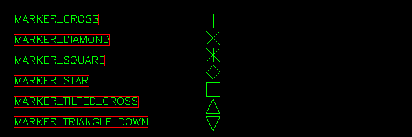
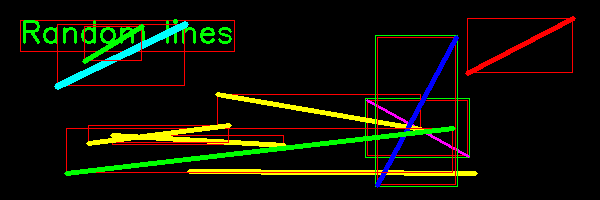

Basic shapes
============

In this section we going create classes to add basic shapes to an image:

* Marker
* Line
* Arrow
* Rectangle
* Circle
* Ellipse
* Polygon

Finding OpenCV attributes
-------------------------

OpenCV has 1912 attributes, which can be verified with the following command:

>>> len(dir(cv))
1921

We define a small function for matching this large attribute list
with a regular expression::

    def cv_dir(regex):
        atts = dir(cv)
        return [s for s in atts if re.match(regex, s)]

We use it to find the markers

>>> cv_dir('MARKER.*')cv_d
['MARKER_CROSS',
 'MARKER_DIAMOND',
 'MARKER_SQUARE',
 'MARKER_STAR',
 'MARKER_TILTED_CROSS',
 'MARKER_TRIANGLE_DOWN',
 'MARKER_TRIANGLE_UP']

Marker
------

We base the Marker class on the Node class. At first we set the options as 
class attribute of the Marker class::

    class Marker(Node):
        options = dict( color=GREEN,
                        markerType=cv.MARKER_CROSS,
                        markerSize=20,
                        thickness=1,
                        line_type=8)

Then we define the :meth:`__init__` method, which only has options. Four of them
(pos, size, gap, dir) are applied to Node, and the rest are specific to the Marker
class (color, markerType, markerSize, thickness, line_type). The method
:meth:`set_class_options` sets these options::

    def __init__(self, **options):
        super().__init__(**options)
        self.set_class_options(options)

We set the size to 20x20 which is the size of the markers. To better see the 
markers, we do not display the frame::

        self.size = np.array((20, 20))
        self.frame = False
        cv.imshow(self.win.win, self.img)

Finally we create the :meth:`draw` method::

    def draw(self, pos=np.array((0, 0))):
        super().draw(pos)
        x, y = pos + self.pos + (10, 10)
        cv.drawMarker(self.img, (x, y), **self.options)

.. autoclass:: shape1.Demo

Line
----

When creating the :class:`Line` we first define the default options 
as **class attribute**::

    class Line(Node):
        options = dict( color=GREEN,
                        thickness=1,
                        lineType=cv.LINE_8,
                        shift=0)

Then we create the constructor method which first calls the init method of 
the parent class (Node), initializing the geometry options (pos, size, gap, dir)::

    def __init__(self, p0, p1, **options):
        super().__init__(**options)

Then we update the class options (Line.options)::

        self.set_class_options(options)

Finally we save the two points in an array, and use this pts array to set 
position and size of the node::

        self.pts = [np.array(p0), np.array(p1)]
        self.set_pos_size(self.pts)

When drawing the line object we start by first calling the parent (Node) **draw** method
Then we add the three position components:

* the parent node position (pos)
* the Node position (self.pos)
* the individual point positions (pts) ::

    def draw(self, pos=np.array((0, 0))):
        super().draw(pos)
        pts = pos + self.pos + self.pts
        pts = tuple(map(tuple, pts))
        cv.line(self.img, *pts, **self.options)

The demo program draws 10 randomly positioned lines::

    for i in range(10):
        col = random.choice([RED, GREEN, BLUE, YELLOW, CYAN, MAGENTA])
        p0 = (random.randint(10, 590), random.randint(10, 190))
        p1 = (random.randint(10, 590), random.randint(10, 190))
        d = random.randint(1, 5) 
        Line(p0, p1, thickness=d, color=col)

.. autoclass:: shape2.Demo

Arrow
-----

All the next few classes are easy to implement. They all can be subclassed from 
:class:`Node2`. 

.. attention::

    The Line class has an attribute **lineType** whereas the Arrow class
    uses the attribute name **line_type**.

The Arrow class definition starts by defining the default option::

    class Arrow(Node2):
        options = dict( color=RED,
                    thickness=1,
                    line_type=cv.LINE_8,
                    shift=0,
                    tipLength=0.1)

Then the parent (Node2) init function is called, and finally the class options are 
updated::

    def __init__(self, p0, p1, **options):
        super().__init__(p0, p1, **options)
        self.set_class_options(options)

In the drawing method the ``cv.arrowedLine`` function is called::

    def draw(self, pos=np.array((0, 0))):
        super().draw(pos)
        cv.arrowedLine(self.img, *self.abs_pts, **self.options)

The demo program draws 10 randomly positioned lines::

        for i in range(10):
            col = random.choice([RED, GREEN, BLUE, YELLOW, CYAN, MAGENTA, WHITE])
            p0 = (random.randint(10, 590), random.randint(10, 190))
            p1 = (random.randint(10, 590), random.randint(10, 190))
            d = random.randint(1, 5) 
            Arrow(p0, p1, thickness=d, color=col)

.. autoclass:: shape3.Demo

.. image:: shape3.*

Rectangle
---------

The rectangle class is similar to the Arrow and Line class::

    class Rectangle(Node2):
        options = dict( color=GREEN,
                        thickness=1,
                        lineType=cv.LINE_8,
                        shift=0)

        def __init__(self, p0, p1, **options):
            super().__init__(p0, p1, **options)
            self.set_class_options(options)

        def draw(self, pos=np.array((0, 0))):
            super().draw(pos)
            cv.rectangle(self.img, *self.abs_pts, **self.options)

As demo example we print 10 random rectangles.

.. autoclass:: shape4.Demo

.. image:: shape4.*

Ellipses
--------

As demo example we print 10 random ellipses.

.. autoclass:: shape5.Demo

.. image:: shape5.*

Polygon
-------

As demo example we print 3 random polygons with 5 vertices.

.. autoclass:: shape6.Demo

.. image:: shape6.*

https://docs.opencv.org/master/d6/d6e/group__imgproc__draw.html
