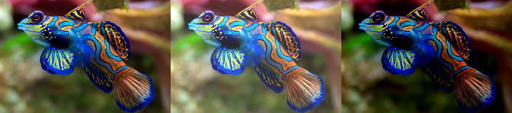
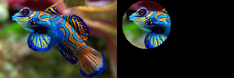
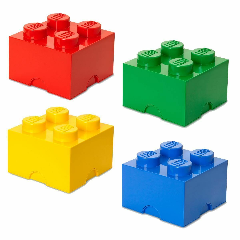
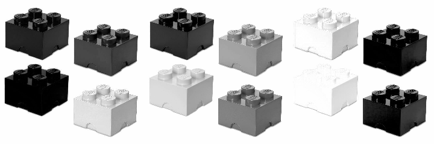
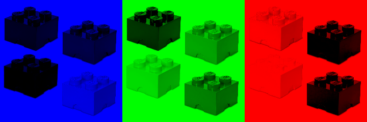
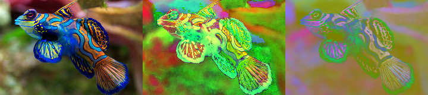
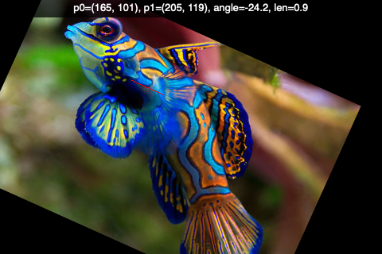

Image transformation
====================

Translation
-----------

Translating an image is shifting it along the x and y axes.
A affine transformation can be obtained by using a transformation matrix ``M``.
It is a translation matrix which shifts the image by the vector (x, y). 
The first row of the matrix is [1, 0, x], the second is [0, 1, y]
 ::

    M = np.float32([[1, 0, x], [0, 1, y]])
    shifted = cv.warpAffine(img, M, size)

.. image:: transform1.png

:download:`fish.jpg<fish.jpg>`

.. literalinclude:: transform1.py

:download:`transform1.py<transform1.py>`

Rotation
--------

When we rotate an image we need to specify the center of rotation. 
Here we take the center of the image::

    h, w = img.shape[:2]
    center = w//2, h//2

To obtain the rotation matrix we use the function ``cv.getRotationMatrix2D``. 
It takes three arguments: 

* the rotation center, 
* the roation angle and 
* the scale factor

.. image:: transform2.png

.. literalinclude:: transform2.py

:download:`transform2.py<transform2.py>`

Scale
------

Scaling an image is to change its dimension.

.. image:: transform3.png

.. literalinclude:: transform3.py

:download:`transform3.py<transform3.py>`

Flipping
--------

Horizontally or vertically using a key.

.. image:: transform4.png

.. literalinclude:: transform4.py

:download:`transform4.py<transform4.py>`

Image artithmetic
-----------------

The operation ``add`` and ``subtract`` allow to add two images. 
The ``add`` function is limited to 255. 
The ``subtract`` function is limit to 0. 
In the example below we add or subtract the value (40, 40, 40) to each pixel.
As a result, the image becomes brighter or darker.

.. literalinclude:: transform5.py

:download:`transform5.py<transform5.py>`

Bitwise operations
------------------

Bitwise operations act on grayscale images. 
Most often it is used on black and white images.
We start wtih a circle and a square shape and calculate this three bitwise operations:

* and
* or
* xor (exclusive or)

.. literalinclude:: bitwise.py

:download:`bitwise.py<bitwise.py>`

Masking
-------

We can use a mask to extract only a certain part of an image.

.. literalinclude:: masking1.py

:download:`masking1.py<masking1.py>`

Splitting channels
------------------

We can split an RGB image into it's components.
Let's use an image which contains the three base colors.

:download:`lego.png<lego.png>`

We find each color component in the separate channel Blue-Green-Red.

.. literalinclude:: splitting1.py

:download:`splitting1.py<splitting1.py>`

Merging channels
----------------

We can merge channels.

.. literalinclude:: splitting2.py

:download:`splitting2.py<splitting2.py>`

A different and faster way of keeping only one color channel and 
setting the others to zero is to act directly on the Numpy array using slice indexing.

.. literalinclude:: splitting3.py

:download:`splitting3.py<splitting3.py>`

Color spaces
------------

So far we have seen the RGB color space.
However there are many other spaces.

The example below shows:

* HSV (Hue-Saturation-Value)
* L*a*b

.. literalinclude:: transform7.py

:download:`transform7.py<transform7.py>`

Affine transformation
---------------------

Here we use the mouse to rotate and scale.

.. literalinclude:: affine1.py

:download:`affine1.py<affine1.py>`

