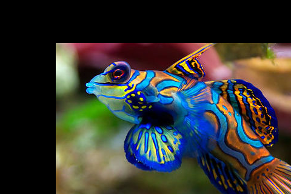
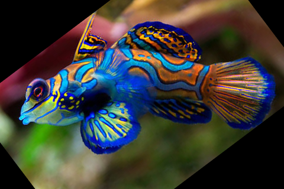
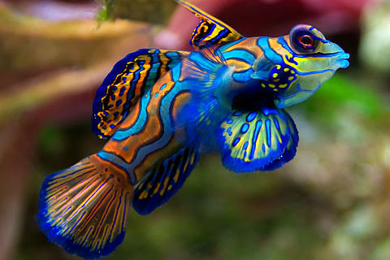

Image transformation
====================

Translation
-----------

Translating an image is shifting it along the x and y axes.
A affine transformation can be obtained by using a transformation matrix ``M``.
It is a translation matrix which shifts the image by the vector (x, y). 
The first row of the matrix is [1, 0, x], the second is [0, 1, y]
 ::

    M = np.float32([[1, 0, x], [0, 1, y]])
    shifted = cv.warpAffine(img, M, size)

.. literalinclude:: transform1.py

:download:`transform1.py<transform1.py>`

Rotation
--------

When we rotate an image we need to specify the center of rotation. 
Here we take the center of the image::

    h, w = img.shape[:2]
    center = w//2, h//2

To obtain the rotation matrix we use the function ``cv.getRotationMatrix2D``. 
It takes three arguments: 

* the rotation center, 
* the roation angle and 
* the scale factor

.. literalinclude:: transform2.py

:download:`transform2.py<transform2.py>`

Scale
------

Scaling an image is to change its dimension.

.. literalinclude:: transform3.py

:download:`transform3.py<transform3.py>`

Flipping
--------

Horizontally or vertically.

.. literalinclude:: transform4.py

:download:`transform4.py<transform4.py>`

Cropping
--------

